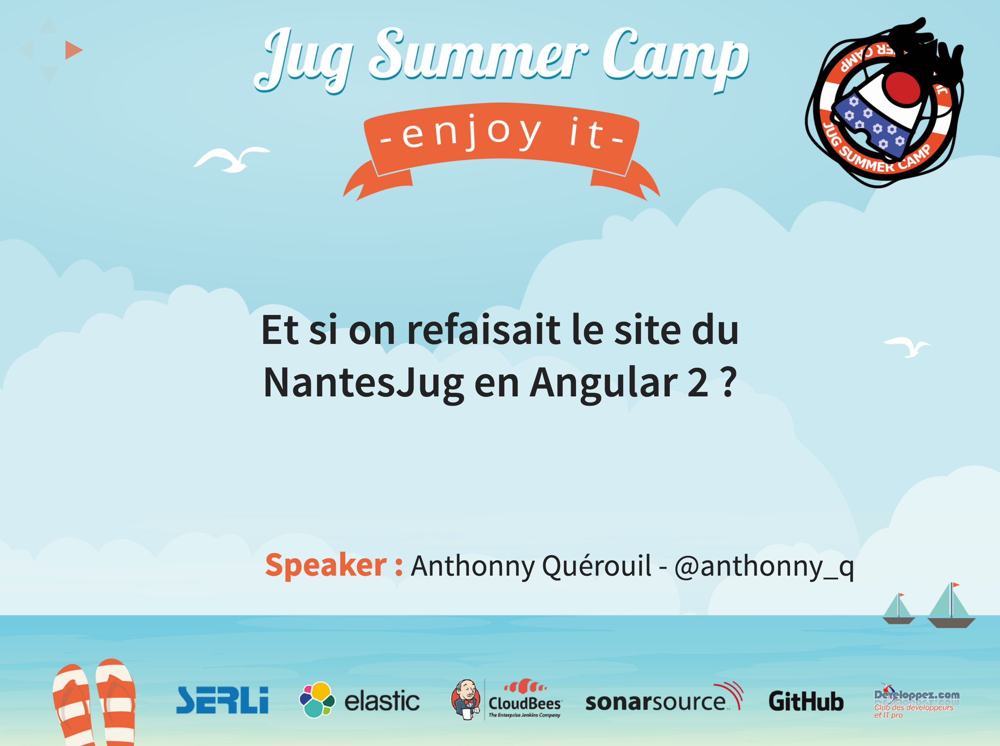

# Starter Kit Jug Summer Camp
:url-asciidoctor: http://asciidoctor.org
:url-asciidoctor-req: https://github.com/asciidoctor/asciidoctor#requirements
:url-install-node-npm: https://docs.npmjs.com/getting-started/installing-node
:url-npm: https://www.npmjs.com/
:url-node: https://nodejs.org/
:url-grunt: http://gruntjs.com/
:url-serli: http://www.serli.com/
:project-name: jsc2015-starterkit

## Prérequis

### Asciidoctor

{url-asciidoctor}[Asciidoctor] est utilisé pour la conversion des fichiers *adoc* avec l'utilisation du backend *reveal.js*.

Pour installer {url-asciidoctor}[Asciidoctor], veuillez suivre les instructions présentes ici :
{url-asciidoctor-req}

### Npm et Node

{url-npm}[Npm] et {url-node}[Node] sont nécessaire pour la gestion des librairies et pour l'exécution du build via {url-grunt}[Grunt].

Pour installer {url-npm}[Npm] et {url-node}[Node], veuillez suivre les instructions présentes ici :
{url-install-node-npm}

### Grunt

{url-grunt}[Grunt] est utilisé pour la phase de build.

Pour installer {url-grunt}[Grunt], veuillez suivre les instructions présentes ici :
http://gruntjs.com/getting-started

## Installation

### Clonage du projet
[source, shell, subs="attributes"]
----
git clone --recursive https://github.com/anthonny/{project-name}.git
----

### Installation des dependences
[source, shell, subs="attributes"]
----
cd {project-name}
npm install
----

## Utilisation

Placez vous dans le dossier *{project-name}*

### Génération des slides

Pour générer les slides, exécutez la commande suivante :
[source, shell]
----
grunt
----

### Serveur et watch

Pour démarrer un serveur sur le port 1337 (configurable dans le fichier *Gruntfile.js*) :
[source, shell]
----
grunt serve
----

A chaque changement sur les fichiers contenus dans le dossier (et sous dossiers) `src/assets`, une copie des assets est effectuée dans le dossier `target`.

A chaque changement sur les fichiers `*.adoc` contenus dans le dossier (et sous dossiers) `src`, une génération du fichier `index.html` est effectuée dans le dossier `target`.

## Copyright

Pour les images fournies par le Jug Summer Camp pour 2015, elles restent la propriété de {url-serli}[SERLi].

Les images sont les suivantes :

* src/assets/theme/jsc2015/jugsummercamp.png
* src/assets/theme/jsc2015/background.png

L'accord préalable de {url-serli}[SERLi] est nécessaire pour toute production et/ou utilisation ultérieure. Une reproduction ou imitation, sous quelque forme ou par quelque procédé que ce soit, est strictement interdite.
